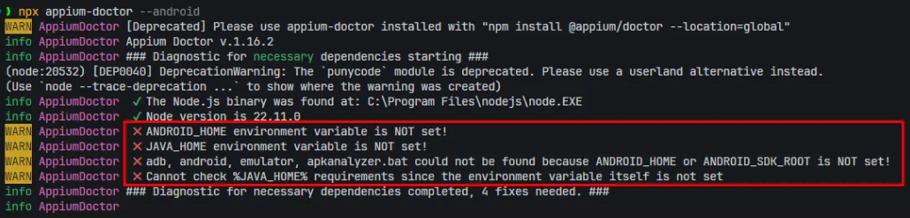
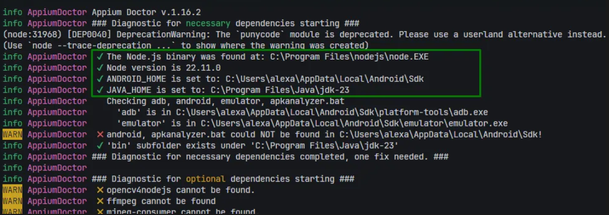

# 👷 Montando o Ambiente para Appium 🏗️ v2.0

Guia completo para configurar e executar testes com Appium no Android. Siga os passos em ordem para melhor compreensão.

---

## Índice

1. [Requisitos Básicos](#requisitos-básicos)
2. [Java](#java-)
3. [Android Studio](#android-studio-)
4. [Variáveis de Ambiente](#variáveis-de-ambiente)
5. [Node.js](#nodejs)
6. [Appium Doctor (Diagnóstico)](#appium-doctor-diagnóstico)
7. [Appium e Driver UIAutomator2](#appium-e-driver-uiautomator2)
8. [Appium Inspector](#appium-inspector)
9. [Capabilities](#capabilities)
10. [Iniciando a Automação](#iniciando-a-automação)
11. [Instalar Aplicativos no Emulador](#instalar-aplicativos-no-emulador)
12. [AVD e ADB](#avd-e-adb)
    - [Comandos ADB úteis](#comandos-adb-úteis)
13. [Docker (Alternativa)](#docker-alternativa)
14. [Referências](#referências)

---

## Requisitos Básicos

Antes de começar, você precisa de:

- **Java JDK** (11 ou superior)
- **Android Studio** (com SDK Manager e Virtual Device Manager)
- **Node.js** e **npm** (para Appium)
- **VS Code** (opcional, mas recomendado)
- **Appium Inspector** (para inspeção visual de elementos)
- Acesso ao terminal/PowerShell com privilégios de administrador

---

## Java ☕

O Java é necessário para executar o Android SDK e suas ferramentas.

1. Baixe o **Java JDK**: https://www.oracle.com/br/java/technologies/downloads/
2. Instale em um local padrão como `C:\Program Files\Java\jdk-23`
3. Configure a variável de ambiente `JAVA_HOME`:
   - **Valor**: `C:\Program Files\Java\jdk-23` (ajuste a versão se necessário)
   - Vá em **Variáveis de Ambiente do Sistema** → **PATH** → **Editar**
   - Adicione uma entrada: `%JAVA_HOME%\bin`

Para verificar se está correto, abra o terminal e digite:
```
java -version
```

---

## Android Studio 📲

O Android Studio fornece o SDK, emuladores e ferramentas necessárias.

1. Baixe e instale: https://developer.android.com/studio?hl=pt-br
2. Na primeira execução, escolha **Custom** (não Standard)
3. Instale os seguintes componentes:
   - **Android Emulator**
   - **Android Emulator Hypervisor Driver** (para melhor performance)
   - **Android SDK Platform-Tools**
   - **Android SDK** (pelo menos uma versão recente e uma mais antiga, ex.: API 29-33)

### Criando um Emulador Virtual (AVD)

1. Abra Android Studio → **Device Manager** (lado direito)
2. Clique em **Create Device**
3. Escolha um dispositivo (ex.: Pixel 2, Pixel 5)
4. Selecione um API Level (ex.: API 31, 32, 33)
5. Clique em **Finish** e depois no ícone de Play para iniciar o emulador

**Dica**: É possível iniciar o emulador diretamente da linha de comando com:
```
emulator -list-avds          # lista emuladores
emulator -avd <nome-do-avd>    # inicia um emulador
```

---

## Variáveis de Ambiente

As variáveis de ambiente permitem que ferramentas como adb, emulator e Appium funcionem de qualquer lugar no terminal.

### JAVA_HOME
- **Valor**: Caminho para o diretório raiz do JDK (ex.: `C:\Program Files\Java\jdk-23`)
- **PATH adicional**: `%JAVA_HOME%\bin`

### ANDROID_HOME
- **Valor**: Caminho para o Android SDK (ex.: `C:\Users\SEU_USUARIO\AppData\Local\Android\Sdk`)
- **PATH adicional**:
  - `%ANDROID_HOME%\platform-tools` (contém `adb`)
  - `%ANDROID_HOME%\emulator` (contém `emulator`)


---

## Node.js

**Opcional, mas recomendado**: Se você precisa gerenciar múltiplas versões do Node, use **NVM** (Node Version Manager):
- Windows: https://github.com/coreybutler/nvm-windows

**Via NVM**

- Instale o NVM que é o gerenciador de versões node, e instale a última versão a partir da que é possível visualizar no site do Node.js.
- Abra o terminal em **modo administrador** e use os comandos NVM após colocá-lo nas variáveis de ambiente, caso ele não faça sozinho
```
nvm --version
```
- Após isso, use o comando “`nvm install xx.xx.xx`” para instalar a versão e depois use o “`nvm use xx.xx.xx`” para começar a usar esta versão.

**Instalando Node globalmente**

Node.js é necessário para instalar e rodar Appium via npm.

1. Baixe Node.js: https://nodejs.org/
2. Escolha a versão **LTS** (recomendado para estabilidade)
3. Instale normalmente
4. Verifique a instalação:
```
node --version
npm --version
```


---

## Appium Doctor (Diagnóstico)

Appium Doctor verifica se seu sistema tem todas as dependências necessárias para executar o appium

**Recomendação**: Eu prefiro utilizar a execução do appium e appium doctor localmente


### Instalação

Caso queira instalar localmente, crie um diretório do projeto e inicie o projeto node com `npm init -y` antes de começar a fazer as instalações de pacotes node.

```
npm install appium-doctor -g #Globalmente
npm install appium-doctor    #Localmente
```

### Uso

```
appium-doctor --android     #Globalmente
npx appium-doctor --android #Localmente
```

Este comando exibe um relatório completo. Exemplos de saída:

**❌ Se faltar algo:**



**✅ Se tudo estiver correto:**



**Passo importante:** Rode o comando de diagnóstico e corrija as pendências até que todos os itens estejam marcados com ✓.

---

## Appium e Driver UIAutomator2

### Instalação (Recomendado: Instalação Local por Projeto)

```
mkdir appium-project #Se não tiver criado o repositório já
cd appium-project
npm init -y #Se já tiver feito, desconsidere
npm install appium
```

**Por que local?** Instalação local permite controle de versão por projeto e evita conflitos globais.

### Alternativa: Instalação Global

```
npm install -g appium
```

### Instalar o Driver UIAutomator2

O driver é responsável por comunicar-se com o Android:

```
npx appium driver install uiautomator2
```

(Se instalou globalmente: `appium driver install uiautomator2`)

### Iniciar o Servidor Appium

```
npx appium
```

Você verá algo como:
```
[Appium] Welcome to Appium v2.x.x
[Appium] Appium REST http interface listener started on 0.0.0.0:4723
```

---

## Appium Inspector

Appium Inspector é uma ferramenta visual para inspecionar elementos do aplicativo e gerar código de teste.

1. Vá em: https://github.com/appium/appium-inspector
2. Procure **Releases** → Baixe a versão mais recente (`.exe` para Windows)
3. Instale normalmente
4. Abra e configure as **Capabilities** (ver seção abaixo)

---

## Capabilities

Capabilities definem como o Appium conecta e controla o aplicativo. Existem dois formatos equivalentes:

### Formato 1: Prefixado com `appium:`

```python
{
  "appium:platformName": "Android",
  "appium:deviceName": "emulator-5554",
  "appium:avd": "Pixel_4_API_31",
  "appium:automationName": "UiAutomator2"
}
```

### Formato 2: Com objeto `appium:options` (recomendado)

```python
{
  "platformName": "Android",
  "appium:options": {
    "automationName": "UiAutomator2",
    "deviceName": "emulator-5554",
    "avd": "Pixel_4_API_31",
    "app": "/caminho/para/app.apk",
    "autoGrantPermissions": true
  }
}
```

### Explicação dos campos:

- **platformName**: `Android` ou `iOS`
- **deviceName**: Nome do emulador (veja com `adb devices`)
- **avd**: Nome do Android Virtual Device
- **automationName**: `UiAutomator2` (para Android)
- **app**: Caminho para o arquivo `.apk` (opcional se apenas inspecionar)
- **autoGrantPermissions**: Concede automaticamente permissões solicitadas

---

## Iniciando a Automação

### Pré-condições:

1. ✅ Emulador criado e em execução (Android Studio ou `emulator -avd <nome-emulador>`)
2. ✅ Appium instalado com driver UIAutomator2
3. ✅ Appium Inspector instalado

### Passos:

1. **Inicie o servidor Appium:**
   ```
   npx appium
   ```
   Você verá a mensagem de sucesso com `http://0.0.0.0:4723`

2. **Abra o Appium Inspector** (para usar a inspeção visual)
   
  
 Apesar de ser possível usar capabilities mais complexas no appium-inspector, algo como o exemplo abaixo já serve para abrir 
   ```
    {
    "platformName": "Android",
    "appium:automationName": "UiAutomator2",
    "appium:deviceName": "<Device-Emulator-Name>"
    }
   ```
   - Coloque as Capabilities
   - Clique em **Start Session**
   - Inspecione elementos clicando neles na tela do emulador

3. **Execute seu teste** (WebdriverIO, Selenium, Robot etc.)

Para executar os testes com os frameworks, deve-se utilizar as capabilities bem definidas, neste caso, a capability abaixo é um bom exemplo:

```
capabilities: [{
        platformName: "Android",
        'appium:deviceName': "<Device-Emulator-Name>"",
        "appium:appPackage": "br.com.calculator.app",
        "appium:appActivity": "br.com.calculator.app.MainActivity",
        'appium:platformVersion': "16",
        'appium:automationName': "UiAutomator2"
    }],
```

---

## Instalar Aplicativos no Emulador

### Opção 1: Drag & Drop (Não recomendado)

1. Baixe o APK de: https://play.google.com/store/apps?hl=pt_BR (usando https://apps.evozi.com/apk-downloader/)
2. Arraste o arquivo `.apk` para dentro da janela do emulador
3. O instalador aparecerá automaticamente

### Opção 2: Linha de Comando (ADB)

1. Abra o terminal no diretório do `.apk`
2. Execute:
   ```
   adb install <nome-do-app.apk> 
   ```
   Ou coloque o caminho do apk, exemplo `./myproject/app/aplicativo.apk`

### Encontrar o AppPackage e AppActivity

Após instalar, abra o app no emulador e execute:

```powershell
adb shell dumpsys window windows | findstr "mCurrentFocus"
```

Retorno esperado:
```
mCurrentFocus=Window{abc123 u0 com.exemplo.app/com.exemplo.app.MainActivity}
```

- **appPackage**: `com.exemplo.app`
- **appActivity**: `com.exemplo.app.MainActivity`

---

## AVD e ADB

### AVD (Android Virtual Device)

AVD é um emulador Android. Você pode criar via Android Studio ou linha de comando.

**Listar AVDs:**
```
emulator -list-avds
```

**Iniciar um AVD:**
```
emulator -avd nome-do-avd
```

### ADB (Android Debug Bridge)

ADB é a ferramenta para comunicação com o emulador/dispositivo.

**Conectar ao shell interativo:**
```
adb shell
```

---

### Comandos ADB úteis

Para mais informações: https://github.com/clarabez/comandosadb

- **`adb devices`**
  - Lista todos os dispositivos (emuladores e físicos) conectados e seu estado (device, offline, unauthorized). Use para confirmar se o emulador/dispositivo está visível para o ADB.

- **`adb install <arquivo.apk>`**
  - Instala um APK no dispositivo/emulador conectado. Substitua `<arquivo.apk>` pelo caminho para o arquivo. Ex.: `adb install app/build/outputs/apk/debug/app-debug.apk`.

- **`adb uninstall <package.name>`**
  - Remove/desinstala o pacote indicado do dispositivo/emulador. Ex.: `adb uninstall com.google.android.calculator` remove a calculadora.

- **`adb shell dumpsys window windows | findstr 'mCurrentFocus'`** (Windows)
  - Exibe qual janela/atividade está em foco no momento no dispositivo. Útil para capturar `appPackage` e `appActivity` ao inspecionar um app.

- **`adb shell dumpsys window | findstr "mCurrentFocus"`** (Windows alternativo)
  - Mesmo propósito do comando acima; dependendo da versão do ADB/Windows, uma das variantes retorna o resultado corretamente.

- **`adb shell dumpsys window windows | grep mCurrentFocus`** (Linux/macOS)
  - Versão para sistemas Unix-like que usa `grep` em vez de `findstr`.

- **`adb shell pm list packages`**
  - Lista todos os pacotes instalados no dispositivo.

- **`adb shell pm list packages | findstr "nome-do-app"`** (Windows)
  - Procura por um pacote específico.

- **`adb shell getprop ro.build.version.release`**
  - Retorna a versão do Android (ex.: `10`, `11`, `12`). Útil para verificar qual API/versão o emulador está executando.

- **`adb uninstall io.appium.uiautomator2.server`**
  - Remove o servidor auxiliar do Appium (uiautomator2). Usado quando há problemas de comunicação ou erros de servidor do UIAutomator2.

- **`adb uninstall io.appium.uiautomator2.server.test`**
  - Remove o pacote de testes do UIAutomator2. Também usado em procedimentos de limpeza quando houver falhas relacionadas ao driver.

**Dicas:**
- Muitos comandos aceitam `-s <serial>` para direcionar um dispositivo específico quando há múltiplos conectados.
- `adb shell` abre um terminal interativo no dispositivo.

---

## Docker (Alternativa)

Se preferir isolar o ambiente em um container, use a imagem **docker-android** com Appium pré-instalado.

Repositório: https://github.com/budtmo/docker-android

### Arquivo docker-compose.yml

```yaml
version: '3.8'

services: 
  android:
    privileged: true
    image: budtmo/docker-android:emulator_14.0
    container_name: android-container
    shm_size: 4g
    ports:
      - "6080:6080"      # noVNC (visualização)
      - "4723:4723"      # Appium
      - "5554:5554"      # Emulador
      - "5555:5555"      # ADB
    environment:
      - APPIUM=true
      - EMULATOR_DEVICE=Nexus 4
      - WEB_VNC=true
    volumes:
      - "./app:/root/tmp"
    devices:
      - "/dev/kvm"
```

### Iniciar o Container

```
docker compose up -d
```

### Acessar o Emulador

Abra http://localhost:6080/ no navegador para ver a tela do emulador (noVNC).

### Executar Comandos no Container

```
docker exec -it android-container /bin/sh
```

Dentro do container, você pode usar `adb`, `emulator` e `appium` normalmente.

### Instalar APK no Container

Se colocar o APK na pasta `./app`, ele estará disponível como `/root/tmp` dentro do container:

```
docker exec -it android-container adb install /root/tmp/seu-app.apk
```

---

## Executando Testes

**Executando o código no arquivo de teste do repositório (WebdriverIO)**

Abra no diretório principal e execute o comando `npm init -y` ou caso queira personalizar o arquivo package.json digite apenas `npm init`

Feito isso, instale o webdriverio usando `npm install webdriverio`

E execute o comando `node teste.js`

**Executando o código no arquivo de teste do repositório (Python + Selenium)**

Instale as dependências do projeto utilizando `pip install -r requirements.txt` , que fará a instalação do [Appium Python Client](https://pypi.org/project/Appium-Python-Client/) que é a forma que o python vai se conectar com o appium e enviar os comandos de interação.

Ao finalizar a instalação, execute o docker que está no repositório utilizando `docker compose up -d` e rode a execução utilizando `python .\python\appiump.py`.

Você pode ver a execução utilizando o noVNC pelo link http://localhost:6080/ (caso você não tenha alterado nenhuma porta). 

Caso queira alterar algum comando ou verificar os identificadores, utilize o [Appium Inspector](#iniciando-com-appium-emulador-local-️)

(Certifique-se que `requirements.txt` contém `Appium-Python-Client`)

---

## Referências

- [Appium Documentation](https://appium.io/docs/en/latest/)
- [GitHub: clarabez/appium](https://github.com/clarabez/appium)
- [Appium Inspector](https://github.com/appium/appium-inspector)
- [Udemy: Testes com Appium](https://www.udemy.com/course/testes-appium/)
- [YouTube: Appium Tutorial](https://www.youtube.com/watch?v=R1vm0RF66C8)
- [Android Studio](https://developer.android.com/studio?hl=pt-br)
- [Docker Android](https://github.com/budtmo/docker-android)
- [ADB Comandos](https://github.com/clarabez/comandosadb)
